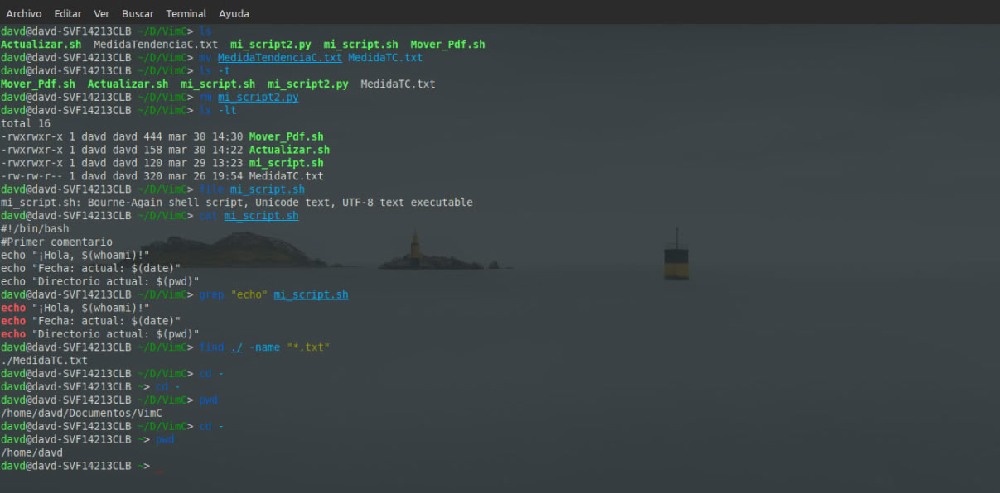

# _Bash__
Repositorio con recursos para aprender a manipular archivos y carpetas desde la terminal de Linux, y tambien contiene algunos recursos para scripting.

<div align="center">
   
</div>

##  Contenido

-  **Comandos** basicos para la terminal
-  **Scripts** basicos
-  Informacion para crear tus propios scripts
-  Apuntes de un estudiante

##  Estructura del Repositorio

```main
.
├── Scripts-Bash/         # Scripts básicos
├── Comandos-Bash/        # Lista con comandos basicos
└── README.md             # Lo que estas leyendo
